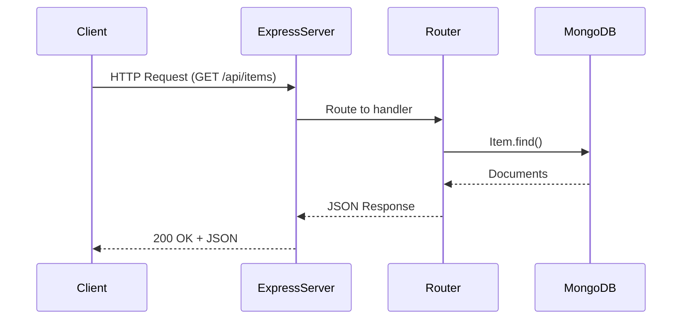

# Inventory App – API & Backend Design

## 1. Backend Overview

- **Framework**: Express.js
    - **
- **Database**: MongoDB (via Mongoose)
    - **
- **Environment Config**: `.env` for MONGO_URI
    - **
- **CORS** enabled for cross-origin access
    - **
- **JSON** body parsing with `express.json()`
    - **

## 2. Folder Structure

```plaintext
api/
├── index.js              # Entry point, sets up Express server
├── routes/
│   └── items.js          # CRUD routes for Item model
└── models/
    └── Item.js           # Mongoose schema for Item
```

## 3. Item Schema

```js
const itemSchema = new mongoose.Schema({
  name: { type: String, required: true },
  quantity: { type: Number, required: true },
  location: { type: String },
  description: { type: String }
}, { timestamps: true });
```

## 4. API Endpoints

### Base Route: `/api/items`

| Method | Endpoint        | Description       |
|--------|------------------|-------------------|
| GET    | `/`              | Fetch all items   |
| GET    | `/:id`           | Fetch item by ID  |
| POST   | `/`              | Create new item   |
| DELETE | `/:id`           | Delete an item    |

## 5. Sequence Diagram



## 6. Error Handling

- `404 Not Found`: When an item does not exist
- `400 Bad Request`: Validation errors
- `500 Internal Server Error`: DB connection or logic failure

- paragraph explianation ...

## 7. Environment Configuration

```dotenv
MONGO_URI="your-mongodb-connection-string"
PORT=5055
```
