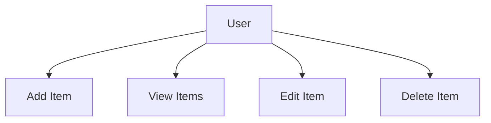
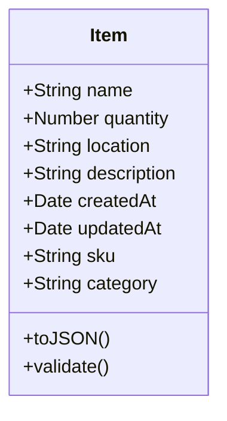
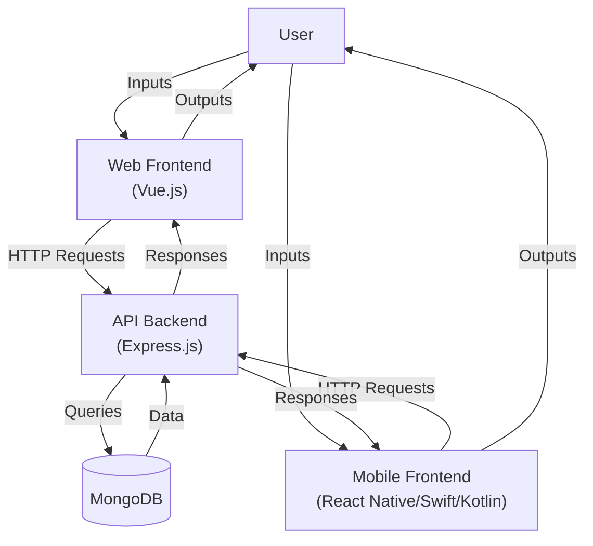

# Inventory App Design Document

## Introduction

The Inventory App is a cross-platform application designed as a generic template for managing inventories across various domains (e.g., warehouse, retail, personal collections). It provides a user-friendly interface for adding, viewing, editing, and deleting items, with support for web and mobile platforms. The app leverages a modern tech stack for scalability, maintainability, and extensibility. This document outlines the system architecture, data models, API design, frontend designs for web (Vue.js), mobile (React Native, Swift for iOS, Kotlin for Android), backend (Express.js, MongoDB), a data flow diagram, and 12 detailed enhancement suggestions to improve functionality, usability, and scalability.

**Goals**:
- Provide a reusable, modular inventory management solution.
- Support web (Vue.js) and mobile clients (React Native, with native Swift for iOS and Kotlin for Android).
- Ensure a robust backend with Express.js and MongoDB.
- Enable extensibility for future features (e.g., categories, user authentication).

## 1. System Architecture Overview

The system follows a client-server architecture with a RESTful API, enabling web and mobile clients to interact with a centralized backend. Shared logic ensures consistency across platforms.

```plaintext
+-------------+     HTTP     +-------------+     Mongoose    +-------------+
| Vue.js Web  |  <------->   |  Express.js |  <----------->  |  MongoDB    |
| React Native|              |    API      |                 |             |
| Swift (iOS) |              |             |                 |             |
| Kotlin (Android) |         |             |                 |             |
+-------------+              +-------------+                 +-------------+
        ^                         ^                                 
        | Axios                   | CORS, JSON                     
        |                         |
        +----- Shared Logic ------+
              (e.g., @shared/api)
```

### Key Components
- **Vue.js Web**: A single-page application (SPA) using Vue Router and TailwindCSS.
- **React Native Mobile**: A cross-platform mobile app for iOS and Android using React Navigation.
- **Swift (iOS)**: Native iOS implementation using SwiftUI for performance and Apple ecosystem integration.
- **Kotlin (Android)**: Native Android implementation using Jetpack Compose for modern, reactive UI and Android-specific features.
- **Express.js API**: A Node.js backend handling CRUD operations with middleware for CORS, JSON parsing, and error handling.
- **MongoDB**: A NoSQL database accessed via Mongoose for schema validation and querying.
- **Shared Logic**: A package (`@shared/api`) with reusable API helpers (e.g., Axios for web/React Native, Retrofit for Kotlin, URLSession for Swift).

### Scalability Considerations
- **Horizontal Scaling**: Deploy Express.js API across multiple instances behind a load balancer.
- **Database**: Use MongoDB sharding for large datasets.
- **Caching**: Add Redis for frequently accessed data to reduce database load.

## 2. Use Case Diagram

The primary actor is a **User** (e.g., inventory manager, shop owner). Below is a use case diagram in Mermaid syntax.



### Use Case Descriptions
- **Add Item**: Create a new item with details (name, quantity, location, description).
- **View Items**: Retrieve and display a list of all items or a single item’s details.
- **Edit Item**: Update an existing item’s details.
- **Delete Item**: Remove an item from the inventory.

### Future Use Cases
- **Search Items**: Filter or search items by name, location, or other attributes.
- **Categorize Items**: Group items by categories or tags.
- **User Authentication**: Restrict access to authorized users.
- **Cross-Platform Sync**: Synchronize data across iOS (Swift) and Android (Kotlin).

## 3. Class Diagram

The core data model is the `Item`, representing an inventory item.

### Item Model
- **Attributes**:
  - `name: String` (required, e.g., "Laptop")
  - `quantity: Number` (required, e.g., 10)
  - `location: String` (optional, e.g., "Warehouse A")
  - `description: String` (optional, e.g., "Dell XPS 13")
  - `createdAt: Date` (auto-generated)
  - `updatedAt: Date` (auto-generated)
  - `sku: String` (optional, unique, e.g., "LAP123")
  - `category: String` (optional)

- **Methods**:
  - `toJSON()`: Serialize item data for API responses.
  - `validate()`: Ensure required fields meet constraints.



## 4. Sequence Diagrams

### Add Item
```plaintext
User -> Web/Mobile App: Click "Add Item"
Web/Mobile App -> Express API: POST /api/items {name, quantity, location, description}
Express API -> MongoDB: Save Item
MongoDB -> Express API: Item Saved
Express API -> Web/Mobile App: 201 Created + Item
Web/Mobile App -> User: Display Success Message
```

### View Items
```plaintext
User -> Web/Mobile App: Navigate to HomePage
Web/Mobile App -> Express API: GET /api/items
Express API -> MongoDB: Item.find()
MongoDB -> Express API: List of Items
Express API -> Web/Mobile App: 200 OK + [Item]
Web/Mobile App -> User: Render Item List
```

### Edit Item
```plaintext
User -> Web/Mobile App: Click "Edit" on Item
Web/Mobile App -> Express API: GET /api/items/:id
Express API -> MongoDB: Item.findById()
MongoDB -> Express API: Item
Express API -> Web/Mobile App: 200 OK + Item
Web/Mobile App -> User: Display Edit Form
User -> Web/Mobile App: Submit Updated Data
Web/Mobile App -> Express API: PUT /api/items/:id {name?, quantity?, location?, description?}
Express API -> MongoDB: Item.findByIdAndUpdate()
MongoDB -> Express API: Updated Item
Express API -> Web/Mobile App: 200 OK + Item
Web/Mobile App -> User: Display Success Message
```

### Delete Item
```plaintext
User -> Web/Mobile App: Click "Delete" on Item
Web/Mobile App -> Express API: DELETE /api/items/:id
Express API -> MongoDB: Item.findByIdAndDelete()
MongoDB -> Express API: Deletion Confirmed
Express API -> Web/Mobile App: 204 No Content
Web/Mobile App -> User: Display Success Message
```

## 5. API Documentation

### Base URL: `/api/items`

| Method | Endpoint         | Description       | Request Body                                      | Response Body       | Status Codes |
|--------|------------------|-------------------|--------------------------------------------------|--------------------|--------------|
| GET    | `/`              | List all items    | N/A                                              | `[Item]`           | 200, 500     |
| GET    | `/:id`           | Get item by ID    | N/A                                              | `Item`             | 200, 404, 500|
| POST   | `/`              | Create new item   | `{ name, quantity, location?, description? }`     | `Item`             | 201, 400, 500|
| PUT    | `/:id`           | Update an item    | `{ name?, quantity?, location?, description? }`   | `Item`             | 200, 400, 404, 500 |
| DELETE | `/:id`           | Delete an item    | N/A                                              | N/A                | 204, 404, 500|

### Example Requests/Responses

#### GET /api/items
- **Request**: `GET /api/items`
- **Response** (200):
  ```json
  [
    {
      "_id": "12345",
      "name": "Laptop",
      "quantity": 10,
      "location": "Warehouse A",
      "description": "Dell XPS 13",
      "createdAt": "2025-05-22T15:00:00Z",
      "updatedAt": "2025-05-22T15:00:00Z"
    }
  ]
  ```

#### POST /api/items
- **Request**:
  ```json
  {
    "name": "Mouse",
    "quantity": 50,
    "location": "Shelf B",
    "description": "Wireless Logitech"
  }
  ```
- **Response** (201):
  ```json
  {
    "_id": "67890",
    "name": "Mouse",
    "quantity": 50,
    "location": "Shelf B",
    "description": "Wireless Logitech",
    "createdAt": "2025-05-22T15:01:00Z",
    "updatedAt": "2025-05-22T15:01:00Z"
  }
  ```

#### Error Response (400)
- **Response**:
  ```json
  {
    "error": "Name and quantity are required"
  }
  ```

## 6. MongoDB Schema (Mongoose)

```javascript
const mongoose = require('mongoose');

const itemSchema = new mongoose.Schema({
  name: { type: String, required: true, trim: true },
  quantity: { type: Number, required: true, min: 0 },
  location: { type: String, trim: true },
  description: { type: String, trim: true },
  sku: { type: String, unique: true, sparse: true },
  category: { type: String, trim: true }
}, {
  timestamps: true,
  toJSON: { virtuals: true }
});

itemSchema.index({ name: 'text', location: 'text' });

module.exports = mongoose.model('Item', itemSchema);
```

### Notes
- **Validation**: Ensures `name` and `quantity` are required, `quantity` >= 0.
- **Indexing**: Text index on `name` and `location` for efficient search.
- **Sparse Index**: Allows `sku` to be unique but optional.
- **Timestamps**: Adds `createdAt` and `updatedAt`.

## 7. Component Tree

### Vue.js Web
```plaintext
App.vue
├── Header.vue
├── HomePage.vue
│   ├── ItemList.vue
│   │   └── ItemCard.vue
│   ├── AddItemModal.vue
│   ├── EditItemModal.vue
│   ├── ViewItemModal.vue
└── Footer.vue
```

### React Native
```plaintext
App.js
├── HomePage.js
│   ├── ItemList.js
│   │   └── ItemCard.js
├── AddItem.js
├── EditItem.js
└── ViewItem.js
```

### Swift (iOS)
```plaintext
App.swift
├── HomeView.swift
│   ├── ItemListView.swift
│   │   └── ItemCardView.swift
├── AddItemView.swift
├── EditItemView.swift
└── ViewItemView.swift
```

### Kotlin (Android)
```plaintext
MainActivity.kt
├── HomeScreen.kt
│   ├── ItemListScreen.kt
│   │   └── ItemCard.kt
├── AddItemScreen.kt
├── EditItemScreen.kt
└── ViewItemScreen.kt
```

### Additions
- **Header.vue**: Navigation bar with app title and links (web).
- **Footer.vue**: Static footer with version info (web).
- **ItemCard.vue/js/swift/kt**: Reusable component for item details.
- **ViewItemModal.vue/ViewItem.js/ViewItemView.swift/ViewItemScreen.kt**: Read-only item view.

## 8. Navigation Flow

### Web (Vue Router)
```plaintext
/               → HomePage (Item List)
/add            → AddItemModal (Create Item)
/edit/:id       → EditItemModal (Edit Item)
/view/:id       → ViewItemModal (View Item Details)
```

### Mobile (React Navigation)
- **Stack Navigator**:
  - `HomePage`: Default screen with item list.
  - `AddItem`: Screen for creating a new item.
  - `EditItem`: Screen for editing an item.
  - `ViewItem`: Screen for viewing item details.

### Mobile (SwiftUI, iOS)
- **NavigationStack**:
  - `HomeView`: Item list.
  - `AddItemView`: Create item.
  - `EditItemView`: Edit item.
  - `ViewItemView`: View item details.

### Mobile (Jetpack Compose, Android)
- **NavHost**:
  ```kotlin
  @Composable
  fun AppNavigation() {
      val navController = rememberNavController()
      NavHost(navController, startDestination = "home") {
          composable("home") { HomeScreen(navController) }
          composable("add") { AddItemScreen(navController) }
          composable("edit/{id}") { backStackEntry ->
              EditItemScreen(navController, backStackEntry.arguments?.getString("id") ?: "")
          }
          composable("view/{id}") { backStackEntry ->
              ViewItemScreen(navController, backStackEntry.arguments?.getString("id") ?: "")
          }
      }
  }
  ```

### Notes
- **Web**: Modals keep users on the same page.
- **Mobile (React Native)**: Separate screens for native feel.
- **Mobile (SwiftUI/Kotlin)**: NavigationStack/NavHost for consistent, native navigation.

## 9. Data Flow Diagram

The Data Flow Diagram (DFD) illustrates how data moves through the Inventory App system, from user interactions to database storage and back. It covers the web frontend (Vue.js), mobile frontend (React Native, Swift for iOS, Kotlin for Android), API backend (Express.js), and MongoDB database.

### Level-0 DFD (Context Diagram)
- **External Entity**: User
- **Process**: Inventory App System
- **Data Store**: MongoDB
- **Data Flows**:
  - **User Inputs**: Commands like add item, view items, edit item, delete item.
  - **User Outputs**: Visual outputs like item lists, success messages, error alerts.
  - **Item Data**: Read/write operations between the system and MongoDB.

### Level-1 DFD
- **External Entity**: User
- **Processes**:
  - **P1: Web Frontend (Vue.js)**: Handles user inputs via browser, renders UI.
  - **P2: Mobile Frontend (React Native/Swift iOS/Kotlin Android)**: Manages mobile inputs, displays screens.
  - **P3: API Backend (Express.js)**: Processes requests, interacts with database.
- **Data Store**: **D1: MongoDB**: Stores item data.
- **Data Flows**:
  - User -> P1: Web inputs (e.g., form submissions, clicks).
  - User -> P2: Mobile inputs (e.g., taps, form data).
  - P1 -> P3: HTTP requests (e.g., POST /api/items, GET /api/items).
  - P2 -> P3: HTTP requests via Axios (React Native), URLSession (Swift), Retrofit (Kotlin).
  - P3 <-> D1: MongoDB queries (e.g., Item.find(), Item.save()).
  - P3 -> P1: HTTP responses (e.g., JSON item data).
  - P3 -> P2: HTTP responses.
  - P1 -> User: Rendered UI (e.g., item list, modals).
  - P2 -> User: Mobile screens (e.g., item list, forms).

### Visual Representation


This DFD provides a high-level view of data movement, complementing the sequence diagrams for specific use cases.

## 10. Additional Considerations

### Security
- **Authentication**: Detailed below.
- **Input Sanitization**: Use `express-validator`.
- **Rate Limiting**: Use `express-rate-limit`.
- **HTTPS**: Enforce SSL in production.

### Testing
- **Unit Tests**: Jest for backend.
- **Integration Tests**: Supertest for API.
- **E2E Tests**: Cypress (web), Detox (React Native), XCTest (Swift), Espresso (Kotlin).

### Deployment
- **Backend**: Heroku, AWS, or Vercel with MongoDB Atlas.
- **Web**: Netlify or Vercel.
- **Mobile**: App Store (Swift), Google Play (Kotlin/React Native).

### Future Features
- **Search and Filters**: Query parameters for GET /api/items.
- **Categories**: Extend schema for categorization.
- **Images**: File uploads to S3/Cloudinary.
- **Analytics**: Track inventory changes.

### Future Use Case: Native Mobile Development with Swift (iOS) and Kotlin (Android)

**Use Case**: *Native Mobile Inventory Management*

The Inventory App can transition to fully native mobile apps using Swift for iOS and Kotlin for Android, complementing or replacing React Native. This ensures optimal performance, native UI/UX, and platform-specific feature integration while maintaining the Express.js/MongoDB backend.

#### Description
- **Swift (iOS)**: Use SwiftUI for a declarative, high-performance UI, leveraging Apple’s ecosystem (e.g., Core Data, Live Activities).
- **Kotlin (Android)**: Use Jetpack Compose for a modern, reactive UI, integrating Android features (e.g., WorkManager, Material Design).
- **Shared Logic**: Share API models and validation logic via a common module (e.g., JSON-based data classes in Kotlin, Codable structs in Swift).

#### Implementation Details
- **Architecture**: Both apps interact with the Express.js API via HTTP. Swift uses `URLSession`, Kotlin uses `Retrofit`.
- **Component Structure**:
  - iOS: SwiftUI views (`HomeView`, `ItemListView`).
  - Android: Compose screens (`HomeScreen`, `ItemListScreen`).
- **Data Flow**: ViewModels manage state and API calls, using Combine (Swift) or Flow (Kotlin) for reactivity.
- **Platform-Specific Features**:
  - iOS: Haptic feedback, iCloud sync.
  - Android: Material theming, background tasks.

#### Benefits
- **Performance**: Native compilation ensures fast rendering.
- **UI/UX**: Platform-authentic interfaces.
- **Code Sharing**: Shared API logic reduces duplication.
- **Scalability**: Native apps handle large datasets efficiently.

#### Challenges and Mitigations
- **Code Duplication**: Separate codebases for Swift/Kotlin. **Mitigation**: Share API models via a common JSON schema.
- **Learning Curve**: Teams need Swift and Kotlin expertise. **Mitigation**: Cross-train developers, leverage similar paradigms (e.g., declarative UI).
- **Tooling**: Manage Xcode and Android Studio. **Mitigation**: Use CI/CD for unified workflows.

#### Example Scenario
A manager uses the Swift iOS app with Live Activities for stock alerts and the Kotlin Android app with Material Design for a consistent experience. Adding an item on iOS syncs to Android via the API, with shared validation logic ensuring consistency.

#### Roadmap
- **Phase 1**: Prototype Swift iOS and Kotlin Android apps.
- **Phase 2**: Implement shared API logic.
- **Phase 3**: Add platform-specific features.
- **Phase 4**: Deploy native apps, phase out React Native.

### Enhancement Suggestions

#### 1. Enhanced User Authentication and Authorization

##### Overview
Implementing JWT-based authentication with RBAC enhances security and supports multi-user collaboration.

##### Why
Authentication restricts access, and RBAC enables role-specific permissions (e.g., Admins delete, Viewers read), essential for warehouse teams.

##### Implementation

###### Backend (Express.js)
- Add `User` model:
  ```javascript
  const mongoose = require('mongoose');
  const bcrypt = require('bcrypt');
  const userSchema = new mongoose.Schema({
    username: { type: String, required: true, unique: true },
    password: { type: String, required: true },
    role: { type: String, enum: ['admin', 'manager', 'viewer'], default: 'viewer' }
  });
  userSchema.pre('save', async function(next) {
    if (this.isModified('password')) {
      this.password = await bcrypt.hash(this.password, 10);
    }
    next();
  });
  module.exports = mongoose.model('User', userSchema);
  ```
- Create `/api/auth` endpoints:
  ```javascript
  const express = require('express');
  const jwt = require('jsonwebtoken');
  const bcrypt = require('bcrypt');
  const router = express.Router();
  const User = require('../models/User');
  router.post('/register', async (req, res, next) => {
    try {
      const user = new User(req.body);
      await user.save();
      res.status(201).json({ message: 'User created' });
    } catch (err) { next(err); }
  });
  router.post('/login', async (req, res, next) => {
    try {
      const { username, password } = req.body;
      const user = await User.findOne({ username });
      if (!user || !await bcrypt.compare(password, user.password)) {
        return res.status(401).json({ error: 'Invalid credentials' });
      }
      const token = jwt.sign({ id: user._id, role: user.role }, 'secret', { expiresIn: '1h' });
      res.json({ token });
    } catch (err) { next(err); }
  });
  module.exports = router;
  ```
- Protect routes:
  ```javascript
  const jwt = require('jsonwebtoken');
  const auth = (roles = []) => (req, res, next) => {
    const token = req.headers.authorization?.split(' ')[1];
    if (!token) return res.status(401).json({ error: 'No token provided' });
    try {
      const decoded = jwt.verify(token, 'secret');
      if (roles.length && !roles.includes(decoded.role)) {
        return res.status(403).json({ error: 'Insufficient permissions' });
      }
      req.user = decoded;
      next();
    } catch (err) {
      res.status(401).json({ error: 'Invalid token' });
    }
  };
  router.delete('/:id', auth(['admin']), async (req, res, next) => { /* Deletion logic */ });
  ```

###### Web (Vue.js)
- Add `Login.vue`:
  ```vue
  <template>
    <div class="modal">
      <form @submit.prevent="login">
        <input v-model="username" placeholder="Username" required />
        <input v-model="password" type="password" placeholder="Password" required />
        <button type="submit">Login</button>
      </form>
    </div>
  </template>
  <script>
  import { getItems } from '@shared/api';
  export default {
    data: () => ({ username: '', password: '' }),
    methods: {
      async login() {
        try {
          const { token } = await this.$api.post('/auth/login', {
            username: this.username,
            password: this.password
          });
          localStorage.setItem('token', token);
          this.$router.push('/');
        } catch (err) {
          alert('Login failed');
        }
      }
    }
  };
  </script>
  ```
- Update `@shared/api`:
  ```javascript
  import axios from 'axios';
  const api = axios.create({
    baseURL: 'http://localhost:5055/api',
    headers: { 'Content-Type': 'application/json' }
  });
  api.interceptors.request.use(config => {
    const token = localStorage.getItem('token');
    if (token) config.headers.Authorization = `Bearer ${token}`;
    return config;
  });
  ```

###### Mobile (React Native)
- Add `Login.js`:
  ```javascript
  import AsyncStorage from '@react-native-async-storage/async-storage';
  import { useNavigation } from '@react-navigation/native';
  export default function Login() {
    const [username, setUsername] = useState('');
    const [password, setPassword] = useState('');
    const navigation = useNavigation();
    const login = async () => {
      try {
        const { token } = await api.post('/auth/login', { username, password });
        await AsyncStorage.setItem('token', token);
        navigation.navigate('HomePage');
      } catch (err) {
        alert('Login failed');
      }
    };
    return (
      <View>
        <TextInput value={username} onChangeText={setUsername} placeholder="Username" />
        <TextInput value={password} onChangeText={setPassword} placeholder="Password" secureTextEntry />
        <Button title="Login" onPress={login} />
      </View>
    );
  }
  ```

###### Mobile (Swift, iOS)
- Add `LoginView.swift`:
  ```swift
  struct LoginView: View {
      @State private var username = ""
      @State private var password = ""
      @EnvironmentObject var auth: AuthViewModel
      var body: some View {
          VStack {
              TextField("Username", text: $username)
              SecureField("Password", text: $password)
              Button("Login") {
                  Task { await auth.login(username: username, password: password) }
              }
          }
      }
  }
  class AuthViewModel: ObservableObject {
      func login(username: String, password: String) async {
          do {
              let response = try await URLSession.shared.data(for: URLRequest(url: URL(string: "http://localhost:5055/api/auth/login")!))
              let token = // Parse JSON
              try await KeychainWrapper.standard.set(token, forKey: "authToken")
          } catch { /* Show error */ }
      }
  }
  ```

###### Mobile (Kotlin, Android)
- Add `LoginScreen.kt`:
  ```kotlin
  @Composable
  fun LoginScreen(navController: NavController, viewModel: AuthViewModel = viewModel()) {
      var username by remember { mutableStateOf("") }
      var password by remember { mutableStateOf("") }
      Column {
          TextField(value = username, onValueChange = { username = it }, label = { Text("Username") })
          TextField(value = password, onValueChange = { password = it }, label = { Text("Password") }, visualTransformation = PasswordVisualTransformation())
          Button(onClick = { viewModel.login(username, password) { navController.navigate("home") } }) {
              Text("Login")
          }
      }
  }
  class AuthViewModel : ViewModel() {
      fun login(username: String, password: String, onSuccess: () -> Unit) {
          viewModelScope.launch {
              try {
                  val response = api.login(LoginRequest(username, password))
                  // Save token to SharedPreferences
                  onSuccess()
              } catch (e: Exception) {
                  // Show error
              }
          }
      }
  }
  ```

##### Impact
- Enhances security and supports enterprise use.
- Enables role-based collaboration.

##### Related Considerations
- **Rate Limiting**: Prevent brute-force attacks.
- **Internationalization**: Store language preferences.

#### 2. Advanced Search and Filtering

##### Overview
Advanced search and filtering enhance usability for large inventories.

##### Why
Efficient search by name, category, or quantity improves productivity in large-scale settings.

##### Implementation

###### Backend (Express.js)
- Extend GET `/api/items`:
  ```javascript
  router.get('/', async (req, res, next) => {
    try {
      const { name, category, quantity, sort } = req.query;
      const query = {};
      if (name) query.name = { $regex: name, $options: 'i' };
      if (category) query.category = category;
      if (quantity) query.quantity = { $gte: parseInt(quantity) };
      const items = await Item.find(query).sort(sort || '-createdAt');
      res.json(items);
    } catch (err) { next(err); }
  });
  ```

###### Web (Vue.js)
- Add search UI to `HomePage.vue`:
  ```vue
  <template>
    <div>
      <input v-model="searchQuery" placeholder="Search items..." @input="debounceSearch" />
      <select v-model="categoryFilter">
        <option value="">All Categories</option>
        <option value="electronics">Electronics</option>
      </select>
      <input type="number" v-model="quantityFilter" placeholder="Min Quantity" />
      <ItemList :items="filteredItems" />
    </div>
  </template>
  <script>
  import { debounce } from 'lodash';
  import { getItems } from '@shared/api';
  export default {
    data: () => ({
      searchQuery: '',
      categoryFilter: '',
      quantityFilter: '',
      items: [],
      filteredItems: []
    }),
    created() {
      this.debounceSearch = debounce(this.fetchItems, 300);
      this.fetchItems();
    },
    methods: {
      async fetchItems() {
        const params = new URLSearchParams({
          name: this.searchQuery,
          category: this.categoryFilter,
          quantity: this.quantityFilter
        }).toString();
        this.items = await getItems(`?${params}`);
        this.filteredItems = this.items;
      }
    }
  };
  </script>
  ```

###### Mobile (React Native)
- Add search UI to `HomePage.js`:
  ```javascript
  import { useState, useEffect } from 'react';
  import { TextInput, Picker, FlatList } from 'react-native';
  import { debounce } from 'lodash';
  import { getItems } from '@shared/api';
  export default function HomePage() {
    const [searchQuery, setSearchQuery] = useState('');
    const [categoryFilter, setCategoryFilter] = useState('');
    const [quantityFilter, setQuantityFilter] = useState('');
    const [items, setItems] = useState([]);
    const fetchItems = debounce(async () => {
      const params = new URLSearchParams({
        name: searchQuery,
        category: categoryFilter,
        quantity: quantityFilter
      }).toString();
      const data = await getItems(`?${params}`);
      setItems(data);
    }, 300);
    useEffect(() => { fetchItems(); }, [searchQuery, categoryFilter, quantityFilter]);
    return (
      <View>
        <TextInput value={searchQuery} onChangeText={setSearchQuery} placeholder="Search items..." />
        <Picker selectedValue={categoryFilter} onValueChange={setCategoryFilter}>
          <Picker.Item label="All Categories" value="" />
          <Picker.Item label="Electronics" value="electronics" />
        </Picker>
        <TextInput value={quantityFilter} onChangeText={setQuantityFilter} placeholder="Min Quantity" keyboardType="numeric" />
        <FlatList data={items} renderItem={({ item }) => <ItemCard item={item} />} />
      </View>
    );
  }
  ```

###### Mobile (Swift, iOS)
- Add search UI to `HomeView.swift`:
  ```swift
  struct HomeView: View {
      @StateObject private var viewModel = InventoryViewModel()
      @State private var searchQuery = ""
      @State private var categoryFilter = ""
      @State private var quantityFilter = ""
      var body: some View {
          NavigationStack {
              VStack {
                  TextField("Search items...", text: $searchQuery)
                      .onChange(of: searchQuery) { _ in viewModel.fetchItems() }
                  Picker("Category", selection: $categoryFilter) {
                      Text("All Categories").tag("")
                      Text("Electronics").tag("electronics")
                  }
                  TextField("Min Quantity", text: $quantityFilter)
                      .keyboardType(.numberPad)
                      .onChange(of: quantityFilter) { _ in viewModel.fetchItems() }
                  ItemListView(items: viewModel.items)
              }
          }
      }
  }
  class InventoryViewModel: ObservableObject {
      @Published var items: [Item] = []
      private var searchQuery = ""
      private var categoryFilter = ""
      private var quantityFilter = ""
      func fetchItems() {
          Task {
              let params = ["name": searchQuery, "category": categoryFilter, "quantity": quantityFilter]
                  .compactMap { k, v in v.isEmpty ? nil : "\(k)=\(v)" }
                  .joined(separator: "&")
              let url = URL(string: "http://localhost:5055/api/items?\(params)")!
              let (data, _) = try await URLSession.shared.data(from: url)
              self.items = try JSONDecoder().decode([Item].self, from: data)
          }
      }
  }
  ```

###### Mobile (Kotlin, Android)
- Add search UI to `HomeScreen.kt`:
  ```kotlin
  @Composable
  fun HomeScreen(navController: NavController, viewModel: InventoryViewModel = viewModel()) {
      var searchQuery by remember { mutableStateOf("") }
      var categoryFilter by remember { mutableStateOf("") }
      var quantityFilter by remember { mutableStateOf("") }
      LaunchedEffect(searchQuery, categoryFilter, quantityFilter) {
          viewModel.fetchItems(searchQuery, categoryFilter, quantityFilter)
      }
      Column {
          TextField(value = searchQuery, onValueChange = { searchQuery = it }, label = { Text("Search items...") })
          Spinner(items = listOf("", "electronics"), selected = categoryFilter, onSelected = { categoryFilter = it })
          TextField(value = quantityFilter, onValueChange = { quantityFilter = it }, label = { Text("Min Quantity") }, keyboardOptions = KeyboardOptions(keyboardType = KeyboardType.Number))
          ItemListScreen(items = viewModel.items)
      }
  }
  class InventoryViewModel : ViewModel() {
      private val _items = MutableStateFlow<List<Item>>(emptyList())
      val items: StateFlow<List<Item>> = _items.asStateFlow()
      fun fetchItems(searchQuery: String, category: String, quantity: String) {
          viewModelScope.launch {
              val params = buildMap {
                  if (searchQuery.isNotEmpty()) put("name", searchQuery)
                  if (category.isNotEmpty()) put("category", category)
                  if (quantity.isNotEmpty()) put("quantity", quantity)
              }
              _items.value = api.getItems(params)
          }
      }
  }
  ```

##### Impact
- Improves efficiency for large inventories.
- Enhances UX with intuitive filters.
- Supports enterprise scalability.

##### Related Considerations
- **Analytics Dashboard**: Use search data for analytics.
- **Performance Optimization**: Combine with pagination.

#### 3. Offline Support and Data Sync

##### Overview
Offline mode with local storage and background sync ensures uninterrupted operation in low-connectivity environments.

##### Why
Warehouse workers need offline functionality, with changes syncing when connectivity is restored.

##### Implementation

###### Backend (Express.js)
- Add `/api/sync` endpoint:
  ```javascript
  router.post('/sync', async (req, res, next) => {
    try {
      const { updates } = req.body;
      const results = await Promise.all(updates.map(async update => {
        if (update.operation === 'create') return Item.create(update.data);
        if (update.operation === 'update') {
          const existing = await Item.findById(update.id);
          if (existing.updatedAt > update.timestamp) throw new Error('Conflict');
          return Item.findByIdAndUpdate(update.id, update.data, { new: true });
        }
        if (update.operation === 'delete') return Item.findByIdAndDelete(update.id);
      }));
      res.json(results);
    } catch (err) { next(err); }
  });
  ```

###### Web (Vue.js)
- Use IndexedDB with `dexie.js`:
  ```javascript
  import Dexie from 'dexie';
  const db = new Dexie('InventoryDB');
  db.version(1).stores({ items: '++id, name, quantity', queue: '++id, operation, data, timestamp' });
  async function saveItemOffline(item) {
    await db.items.put(item);
    await db.queue.put({ operation: 'create', data: item, timestamp: new Date() });
  }
  async function syncOffline() {
    if (!navigator.onLine) return;
    const queue = await db.queue.toArray();
    const updates = queue.map(({ operation, data, timestamp }) => ({ operation, data, timestamp }));
    try {
      const results = await api.post('/sync', { updates });
      await db.queue.clear();
      await db.items.bulkPut(results.filter(r => r.operation === 'create' || r.operation === 'update'));
    } catch (err) {
      console.error('Sync failed', err);
    }
  }
  window.addEventListener('online', syncOffline);
  ```

###### Mobile (React Native)
- Use `AsyncStorage` and `react-native-background-fetch`:
  ```javascript
  import AsyncStorage from '@react-native-async-storage/async-storage';
  import BackgroundFetch from 'react-native-background-fetch';
  async function saveItemOffline(item) {
    const queue = JSON.parse(await AsyncStorage.getItem('queue') || '[]');
    queue.push({ operation: 'create', data: item, timestamp: new Date().toISOString() });
    await AsyncStorage.setItem('queue', JSON.stringify(queue));
    await AsyncStorage.setItem(`item_${item.id}`, JSON.stringify(item));
  }
  async function syncOffline() {
    const queue = JSON.parse(await AsyncStorage.getItem('queue') || '[]');
    if (!queue.length) return;
    try {
      const results = await api.post('/sync', { updates: queue });
      await AsyncStorage.setItem('queue', '[]');
      for (const result of results) {
        if (result.operation === 'create' || result.operation === 'update') {
          await AsyncStorage.setItem(`item_${result.id}`, JSON.stringify(result));
        }
      }
    } catch (err) {
      console.error('Sync failed', err);
    }
  }
  BackgroundFetch.configure({ minimumFetchInterval: 15 }, syncOffline);
  ```

###### Mobile (Swift, iOS)
- Use Core Data with `BackgroundTasks`:
  ```swift
  class OfflineStore {
      let context: NSManagedObjectContext
      func saveItem(_ item: Item) async throws {
          let entity = NSEntityDescription.insertNewObject(forEntityName: "Item", into: context)
          entity.setValue(item.id, forKey: "id")
          entity.setValue(item.name, forKey: "name")
          try context.save()
          try await queueChange(operation: "create", data: item, timestamp: Date())
      }
      func queueChange(operation: String, data: Item, timestamp: Date) async throws {
          let change = NSEntityDescription.insertNewObject(forEntityName: "ChangeQueue", into: context)
          change.setValue(operation, forKey: "operation")
          change.setValue(try JSONEncoder().encode(data), forKey: "data")
          change.setValue(timestamp, forKey: "timestamp")
          try context.save()
      }
      func sync() async throws {
          let fetchRequest = NSFetchRequest<NSManagedObject>(entityName: "ChangeQueue")
          let changes = try context.fetch(fetchRequest)
          let updates = changes.map { change in
              [
                  "operation": change.value(forKey: "operation") as! String,
                  "data": try! JSONDecoder().decode(Item.self, from: change.value(forKey: "data") as! Data),
                  "timestamp": change.value(forKey: "timestamp") as! Date
              ]
          }
          let response = try await URLSession.shared.data(for: URLRequest(url: URL(string: "http://localhost:5055/api/sync")!))
      }
  }
  BGTaskScheduler.shared.register(forTaskWithIdentifier: "com.inventory.sync", using: nil) { task in
      Task { try await OfflineStore().sync(); task.setTaskCompleted(success: true) }
  }
  ```

###### Mobile (Kotlin, Android)
- Use Room with WorkManager:
  ```kotlin
  @Entity
  data class ItemEntity(
      @PrimaryKey val id: String,
      val name: String,
      val quantity: Int
  )
  @Entity
  data class ChangeQueue(
      @PrimaryKey(autoGenerate = true) val id: Int = 0,
      val operation: String,
      val data: String,
      val timestamp: Long
  )
  @Dao
  interface InventoryDao {
      @Insert suspend fun insertItem(item: ItemEntity)
      @Insert suspend fun insertChange(change: ChangeQueue)
      @Query("SELECT * FROM ChangeQueue") suspend fun getChanges(): List<ChangeQueue>
      @Query("DELETE FROM ChangeQueue") suspend fun clearChanges()
  }
  class OfflineRepository(private val dao: InventoryDao, private val api: InventoryApi) {
      suspend fun saveItemOffline(item: Item) {
          dao.insertItem(ItemEntity(item.id, item.name, item.quantity))
          dao.insertChange(ChangeQueue(operation = "create", data = Gson().toJson(item), timestamp = System.currentTimeMillis()))
      }
      suspend fun sync() {
          val changes = dao.getChanges()
          val updates = changes.map { Gson().fromJson(it.data, Item::class.java) }
          try {
              api.sync(UpdatesRequest(updates))
              dao.clearChanges()
          } catch (e: Exception) {
              // Handle error
          }
      }
  }
  class SyncWorker(appContext: Context, params: WorkerParameters) : CoroutineWorker(appContext, params) {
      override suspend fun doWork(): Result {
          val repository = OfflineRepository(/* inject */)
          repository.sync()
          return Result.success()
      }
  }
  ```

##### Impact
- Ensures uninterrupted operation.
- Maintains data consistency.
- Critical for mobile users in low-connectivity areas.

##### Related Considerations
- **Real-Time Updates**: Hybrid sync.
- **Performance Optimization**: Optimize local storage.

#### 4. Real-Time Updates with WebSockets

##### Overview
WebSockets enable real-time item updates for multi-user collaboration.

##### Why
Instant updates prevent data conflicts in team settings.

##### Implementation

###### Backend (Express.js)
- Use `socket.io`:
  ```javascript
  const express = require('express');
  const http = require('http');
  const socketIo = require('socket.io');
  const app = express();
  const server = http.createServer(app);
  const io = socketIo(server);
  io.on('connection', socket => {
    socket.on('item:created', item => socket.broadcast.emit('item:created', item));
    socket.on('item:updated', item => socket.broadcast.emit('item:updated', item));
    socket.on('item:deleted', id => socket.broadcast.emit('item:deleted', id));
  });
  router.post('/', async (req, res, next) => {
    try {
      const item = new Item(req.body);
      await item.save();
      io.emit('item:created', item);
      res.status(201).json(item);
    } catch (err) { next(err); }
  });
  server.listen(5055);
  ```

###### Web (Vue.js)
- Use `socket.io-client`:
  ```vue
  <template>
    <ItemList :items="items" />
  </template>
  <script>
  import io from 'socket.io-client';
  import { getItems } from '@shared/api';
  export default {
    data: () => ({ items: [], socket: null }),
    async created() {
      this.items = await getItems();
      this.socket = io('http://localhost:5055');
      this.socket.on('item:created', item => { this.items.push(item); });
      this.socket.on('item:updated', updatedItem => {
        const index = this.items.findIndex(i => i._id === updatedItem._id);
        if (index !== -1) this.items[index] = updatedItem;
      });
      this.socket.on('item:deleted', id => {
        this.items = this.items.filter(i => i._id !== id);
      });
    },
    beforeDestroy() { this.socket.disconnect(); }
  };
  </script>
  ```

###### Mobile (React Native)
- Use `socket.io-client`:
  ```javascript
  import { useState, useEffect } from 'react';
  import { FlatList } from 'react-native';
  import io from 'socket.io-client';
  import { getItems } from '@shared/api';
  export default function HomePage() {
    const [items, setItems] = useState([]);
    useEffect(() => {
      let socket;
      async function init() {
        const data = await getItems();
        setItems(data);
        socket = io('http://localhost:5055');
        socket.on('item:created', item => setItems(prev => [...prev, item]));
        socket.on('item:updated', updatedItem => {
          setItems(prev => prev.map(i => i._id === updatedItem._id ? updatedItem : i));
        });
        socket.on('item:deleted', id => setItems(prev => prev.filter(i => i._id !== id)));
      }
      init();
      return () => socket?.disconnect();
    }, []);
    return <FlatList data={items} renderItem={({ item }) => <ItemCard item={item} />} />;
  }
  ```

###### Mobile (Swift, iOS)
- Use `Starscream`:
  ```swift
  import Starscream
  class InventoryViewModel: ObservableObject {
      @Published var items: [Item] = []
      private var socket: WebSocket?
      init() {
          let url = URL(string: "ws://localhost:5055")!
          socket = WebSocket(request: URLRequest(url: url))
          socket?.onEvent = { event in
              switch event {
              case .text(let string):
                  if let data = string.data(using: .utf8) {
                      if string.contains("item:created") {
                          let item = try! JSONDecoder().decode(Item.self, from: data)
                          DispatchQueue.main.async { self.items.append(item) }
                      }
                  }
              default: break
              }
          }
          socket?.connect()
      }
      deinit { socket?.disconnect() }
  }
  ```

###### Mobile (Kotlin, Android)
- Use `okhttp3` WebSocket:
  ```kotlin
  class InventoryViewModel : ViewModel() {
      private val _items = MutableStateFlow<List<Item>>(emptyList())
      val items: StateFlow<List<Item>> = _items.asStateFlow()
      private val client = OkHttpClient()
      private val request = Request.Builder().url("ws://localhost:5055").build()
      private val listener = object : WebSocketListener() {
          override fun onMessage(webSocket: WebSocket, text: String) {
              val gson = Gson()
              when {
                  text.contains("item:created") -> {
                      val item = gson.fromJson(text, Item::class.java)
                      _items.update { it + item }
                  }
                  text.contains("item:updated") -> {
                      val item = gson.fromJson(text, Item::class.java)
                      _items.update { items -> items.map { if (it.id == item.id) item else it } }
                  }
                  text.contains("item:deleted") -> {
                      val id = // Parse ID
                      _items.update { it.filter { item -> item.id != id } }
                  }
              }
          }
      }
      init {
          client.newWebSocket(request, listener)
      }
      override fun onCleared() {
          client.dispatcher.executorService.shutdown()
      }
  }
  ```

##### Impact
- Enables real-time collaboration.
- Enhances UX with instant updates.

##### Related Considerations
- **Offline Support**: Hybrid sync.
- **Authentication**: Respect user roles.

#### 5. Barcode Scanning and QR Code Integration

##### Overview
Barcode/QR code scanning streamlines item entry and lookup.

##### Why
Scanning reduces manual errors in retail/warehousing workflows.

##### Implementation

###### Backend (Express.js)
- Ensure `sku` is searchable:
  ```javascript
  const itemSchema = new mongoose.Schema({
    sku: { type: String, unique: true, sparse: true, index: true }
  });
  router.get('/by-sku', async (req, res, next) => {
    try {
      const { sku } = req.query;
      const item = await Item.findOne({ sku });
      if (!item) return res.status(404).json({ error: 'Item not found' });
      res.json(item);
    } catch (err) { next(err); }
  });
  ```

###### Web (Vue.js)
- Use `getUserMedia`:
  ```vue
  <template>
    <video ref="video" autoplay></video>
    <button @click="scan">Scan Barcode</button>
  </template>
  <script>
  import jsQR from 'jsqr';
  import { getItems } from '@shared/api';
  export default {
    mounted() {
      navigator.mediaDevices.getUserMedia({ video: { facingMode: 'environment' } })
        .then(stream => { this.$refs.video.srcObject = stream; });
    },
    methods: {
      async scan() {
        const canvas = document.createElement('canvas');
        canvas.width = this.$refs.video.videoWidth;
        canvas.height = this.$refs.video.videoHeight;
        canvas.getContext('2d').drawImage(this.$refs.video, 0, 0);
        const imageData = canvas.getContext('2d').getImageData(0, 0, canvas.width, canvas.height);
        const code = jsQR(imageData.data, imageData.width, imageData.height);
        if (code) {
          const item = await getItems(`/by-sku?sku=${code.data}`);
          this.$router.push({ name: 'EditItem', params: { id: item._id } });
        }
      }
    }
  };
  </script>
  ```

###### Mobile (React Native)
- Use `react-native-vision-camera`:
  ```javascript
  import { Camera } from 'react-native-vision-camera';
  import { useCameraDevices } from 'react-native-vision-camera';
  import { useNavigation } from '@react-navigation/native';
  import { useState } from 'react';
  import { getItems } from '@shared/api';
  export default function BarcodeScanner() {
    const devices = useCameraDevices();
    const device = devices.back;
    const navigation = useNavigation();
    const [scanning, setScanning] = useState(true);
    if (!device) return <Text>Loading...</Text>;
    return (
      <Camera
        style={{ flex: 1 }}
        device={device}
        isActive={true}
        barcodeScannerEnabled={true}
        onBarcodeScanned={async ({ barcodes }) => {
          if (!scanning || !barcodes.length) return;
          setScanning(false);
          const sku = barcodes[0].value;
          try {
            const item = await getItems(`/by-sku?sku=${sku}`);
            navigation.navigate('EditItem', { item });
          } catch (err) {
            alert('Item not found');
          }
        }}
        barcodeScannerSettings={{ barcodeTypes: ['qr', 'ean13'] }}
      />
    );
  }
  ```

###### Mobile (Swift, iOS)
- Use `AVFoundation`:
  ```swift
  import AVFoundation
  class BarcodeScanner: NSObject, AVCaptureMetadataOutputObjectsDelegate {
      private let captureSession = AVCaptureSession()
      private var onScan: ((String) -> Void)?
      func startScanning(onScan: @escaping (String) -> Void) {
          self.onScan = onScan
          guard let device = AVCaptureDevice.default(for: .video),
                let input = try? AVCaptureDeviceInput(device: device) else { return }
          captureSession.addInput(input)
          let output = AVCaptureMetadataOutput()
          captureSession.addOutput(output)
          output.setMetadataObjectsDelegate(self, queue: .main)
          output.metadataObjectTypes = [.qr, .ean13]
          captureSession.startRunning()
      }
      func metadataOutput(_ output: AVCaptureMetadataOutput, didOutput metadataObjects: [AVMetadataObject], from connection: AVCaptureConnection) {
          if let barcode = metadataObjects.first as? AVMetadataMachineReadableCodeObject,
             let sku = barcode.stringValue {
              onScan?(sku)
              captureSession.stopRunning()
          }
      }
  }
  ```

###### Mobile (Kotlin, Android)
- Use CameraX with ML Kit:
  ```kotlin
  @Composable
  fun BarcodeScannerScreen(navController: NavController) {
      val context = LocalContext.current
      val lifecycleOwner = LocalLifecycleOwner.current
      val cameraProviderFuture = remember { ProcessCameraProvider.getInstance(context) }
      AndroidView(
          factory = { PreviewView(context).apply {
              implementationMode = PreviewView.ImplementationMode.COMPATIBLE
              scaleType = PreviewView.ScaleType.FILL_CENTER
          }},
          update = { previewView ->
              cameraProviderFuture.addListener({
                  val cameraProvider = cameraProviderFuture.get()
                  val preview = Preview.Builder().build().also { it.setSurfaceProvider(previewView.surfaceProvider) }
                  val imageAnalysis = ImageAnalysis.Builder()
                      .setBackpressureStrategy(ImageAnalysis.STRATEGY_KEEP_ONLY_LATEST)
                      .build()
                      .also {
                          it.setAnalyzer(ContextCompat.getMainExecutor(context)) { imageProxy ->
                              val barcodeScanner = BarcodeScanning.getClient()
                              barcodeScanner.process(imageProxy)
                                  .addOnSuccessListener { barcodes ->
                                      barcodes.firstOrNull()?.rawValue?.let { sku ->
                                          viewModelScope.launch {
                                              val item = api.getItemBySku(sku)
                                              navController.navigate("edit/${item.id}")
                                          }
                                      }
                                      imageProxy.close()
                                  }
                          }
                      }
                  cameraProvider.bindToLifecycle(lifecycleOwner, CameraSelector.DEFAULT_BACK_CAMERA, preview, imageAnalysis)
              }, ContextCompat.getMainExecutor(context))
          }
      )
  }
  ```

##### Impact
- Speeds up item entry/lookup.
- Reduces errors in workflows.
- Enhances mobile usability.

##### Related Considerations
- **Offline Support**: Store scanned data locally.
- **Analytics Dashboard**: Track scanning frequency.

#### 6. Analytics Dashboard with Visualizations

##### Overview
A dashboard with visualizations provides insights into inventory metrics.

##### Why
Metrics like stock levels and low-stock alerts enhance decision-making.

##### Implementation

###### Backend (Express.js)
- Add `/api/analytics` endpoints:
  ```javascript
  router.get('/summary', async (req, res, next) => {
    try {
      const summary = await Item.aggregate([
        { $group: { _id: '$category', totalQuantity: { $sum: '$quantity' }, count: { $sum: 1 } } }
      ]);
      res.json(summary);
    } catch (err) { next(err); }
  });
  router.get('/low-stock', async (req, res, next) => {
    try {
      const threshold = parseInt(req.query.threshold) || 10;
      const items = await Item.find({ quantity: { $lte: threshold } });
      res.json(items);
    } catch (err) { next(err); }
  });
  ```

###### Web (Vue.js)
- Create `Dashboard.vue`:
  ```vue
  <template>
    <div>
      <h2>Inventory Analytics</h2>
      <canvas ref="categoryChart"></canvas>
      <h3>Low Stock Items</h3>
      <ul>
        <li v-for="item in lowStock" :key="item._id">{{ item.name }}: {{ item.quantity }}</li>
      </ul>
    </div>
  </template>
  <script>
  import Chart from 'chart.js/auto';
  import { getAnalytics } from '@shared/api';
  export default {
    data: () => ({ categories: [], lowStock: [], chart: null }),
    async mounted() {
      const summary = await getAnalytics('/summary');
      this.categories = summary;
      this.lowStock = await getAnalytics('/low-stock?threshold=10');
      this.chart = new Chart(this.$refs.categoryChart, {
        type: 'bar',
        data: {
          labels: this.categories.map(c => c._id || 'Uncategorized'),
          datasets: [{
            label: 'Total Quantity',
            data: this.categories.map(c => c.totalQuantity),
            backgroundColor: ['#4CAF50', '#2196F3', '#FF9800'],
            borderColor: ['#388E3C', '#1976D2', '#F57C00'],
            borderWidth: 1
          }]
        },
        options: { scales: { y: { beginAtZero: true } } }
      });
    }
  };
  </script>
  ```

###### Mobile (React Native)
- Create `Dashboard.js`:
  ```javascript
  import { useState, useEffect } from 'react';
  import { BarChart } from 'react-native-chart-kit';
  import { getAnalytics } from '@shared/api';
  export default function Dashboard() {
    const [categories, setCategories] = useState([]);
    const [lowStock, setLowStock] = useState([]);
    useEffect(() => {
      async function fetchData() {
        setCategories(await getAnalytics('/summary'));
        setLowStock(await getAnalytics('/low-stock?threshold=10'));
      }
      fetchData();
    }, []);
    return (
      <View>
        <Text>Category Breakdown</Text>
        <BarChart
          data={{
            labels: categories.map(c => c._id || 'Uncategorized'),
            datasets: [{ data: categories.map(c => c.totalQuantity) }]
          }}
          width={300}
          height={200}
          chartConfig={{ backgroundColor: '#e26a00', backgroundGradientFrom: '#fb8c00', backgroundGradientTo: '#ffa726', decimalPlaces: 0, color: () => '#fff' }}
        />
        <Text>Low Stock Items</Text>
        <FlatList data={lowStock} renderItem={({ item }) => <Text>{item.name}: {item.quantity}</Text>} />
      </View>
    );
  }
  ```

###### Mobile (Swift, iOS)
- Use Swift Charts:
  ```swift
  import Charts
  struct DashboardView: View {
      @StateObject private var viewModel = AnalyticsViewModel()
      var body: some View {
          VStack {
              Text("Category Breakdown")
              Chart(viewModel.categories) { category in
                  BarMark(x: .value("Category", category.id), y: .value("Quantity", category.totalQuantity))
              }
              .frame(height: 200)
              Text("Low Stock Items")
              List(viewModel.lowStock) { item in
                  Text("\(item.name): \(item.quantity)")
              }
          }
      }
  }
  class AnalyticsViewModel: ObservableObject {
      @Published var categories: [CategorySummary] = []
      @Published var lowStock: [Item] = []
      struct CategorySummary: Identifiable {
          let id: String
          let totalQuantity: Int
      }
      init() {
          Task {
              let summaryData = try await URLSession.shared.data(from: URL(string: "http://localhost:5055/api/analytics/summary")!)
              self.categories = try JSONDecoder().decode([CategorySummary].self, from: summaryData.0)
              let lowStockData = try await URLSession.shared.data(from: URL(string: "http://localhost:5055/api/analytics/low-stock?threshold=10")!)
              self.lowStock = try JSONDecoder().decode([Item].self, from: lowStockData.0)
          }
      }
  }
  ```

###### Mobile (Kotlin, Android)
- Use Charts library (e.g., MPAndroidChart):
  ```kotlin
  @Composable
  fun DashboardScreen(viewModel: AnalyticsViewModel = viewModel()) {
      Column {
          Text("Category Breakdown")
          AndroidView(factory = { context ->
              BarChart(context).apply {
                  data = BarData(viewModel.categories.mapIndexed { index, category ->
                      BarEntry(index.toFloat(), category.totalQuantity.toFloat())
                  }.let { BarDataSet(it, "Quantity").apply { colors = listOf(Color.GREEN, Color.BLUE) } }.let { BarData(it) })
                  invalidate()
              }
          }, modifier = Modifier.height(200.dp))
          Text("Low Stock Items")
          LazyColumn {
              items(viewModel.lowStock) { item ->
                  Text("${item.name}: ${item.quantity}")
              }
          }
      }
  }
  class AnalyticsViewModel : ViewModel() {
      private val _categories = MutableStateFlow<List<CategorySummary>>(emptyList())
      val categories: StateFlow<List<CategorySummary>> = _categories.asStateFlow()
      private val _lowStock = MutableStateFlow<List<Item>>(emptyList())
      val lowStock: StateFlow<List<Item>> = _lowStock.asStateFlow()
      data class CategorySummary(val id: String, val totalQuantity: Int)
      init {
          viewModelScope.launch {
              _categories.value = api.getSummary()
              _lowStock.value = api.getLowStock(threshold = 10)
          }
      }
  }
  ```

##### Impact
- Provides actionable insights.
- Enhances decision-making.
- Increases business value.

##### Related Considerations
- **Search and Filtering**: Refine analytics with search data.
- **Authentication**: Restrict dashboard access.

#### 7. Internationalization (i18n)

##### Overview
Multi-language support broadens global accessibility.

##### Why
Supporting languages like Spanish or Chinese reaches diverse users, e.g., warehouse staff in different regions.

##### Implementation

###### Backend (Express.js)
- Add `translations` field:
  ```javascript
  const itemSchema = new mongoose.Schema({
    name: { type: String, required: true, trim: true },
    translations: {
      name: { en: String, es: String, fr: String, zh: String },
      description: { en: String, es: String, fr: String, zh: String }
    },
    quantity: { type: Number, required: true, min: 0 }
  });
  ```

###### Web (Vue.js)
- Use `vue-i18n`:
  ```vue
  <template>
    <div>
      <select v-model="$i18n.locale">
        <option value="en">English</option>
        <option value="es">Español</option>
      </select>
      <button>{{ $t('addItem') }}</button>
      <ItemList :items="items" />
    </div>
  </template>
  <script>
  import { createI18n } from 'vue-i18n';
  import { getItems } from '@shared/api';
  const i18n = createI18n({
    locale: 'en',
    messages: {
      en: { addItem: 'Add Item', name: 'Name' },
      es: { addItem: 'Agregar Artículo', name: 'Nombre' }
    }
  });
  export default {
    setup() { return { i18n }; },
    data: () => ({ items: [] }),
    async created() { this.items = await getItems(); }
  };
  </script>
  ```

###### Mobile (React Native)
- Use `i18next`:
  ```javascript
  import i18n from 'i18next';
  import { initReactI18next } from 'react-i18next';
  import { useTranslation } from 'react-i18next';
  i18n.use(initReactI18next).init({
    resources: {
      en: { translation: { addItem: 'Add Item', name: 'Name' } },
      es: { translation: { addItem: 'Agregar Artículo', name: 'Nombre' } }
    },
    lng: 'en'
  });
  export default function HomePage() {
    const { t, i18n } = useTranslation();
    const [items, setItems] = useState([]);
    useEffect(() => {
      async function fetchItems() { setItems(await getItems()); }
      fetchItems();
    }, []);
    return (
      <View>
        <Picker selectedValue={i18n.language} onValueChange={lang => i18n.changeLanguage(lang)}>
          <Picker.Item label="English" value="en" />
          <Picker.Item label="Español" value="es" />
        </Picker>
        <Button title={t('addItem')} onPress={() => navigation.navigate('AddItem')} />
        <FlatList data={items} renderItem={({ item }) => <Text>{item.translations.name[i18n.language]}</Text>} />
      </View>
    );
  }
  ```

###### Mobile (Swift, iOS)
- Use `NSLocalizedString`:
  ```swift
  struct HomeView: View {
      @StateObject private var viewModel = InventoryViewModel()
      @State private var locale = Locale.current.languageCode ?? "en"
      var body: some View {
          NavigationStack {
              VStack {
                  Picker("Language", selection: $locale) {
                      Text("English").tag("en")
                      Text("Español").tag("es")
                  }
                  Button(NSLocalizedString("add_item", comment: "")) {
                      // Navigate to AddItemView
                  }
                  List(viewModel.items) { item in
                      Text(item.translations.name[locale] ?? item.name)
                  }
              }
          }
      }
  }
  // Localizable.strings (en)
  "add_item" = "Add Item";
  "name" = "Name";
  // Localizable.strings (es)
  "add_item" = "Agregar Artículo";
  "name" = "Nombre";
  ```

###### Mobile (Kotlin, Android)
- Use Android resources:
  ```kotlin
  @Composable
  fun HomeScreen(navController: NavController, viewModel: InventoryViewModel = viewModel()) {
      val context = LocalContext.current
      var locale by remember { mutableStateOf("en") }
      Column {
          Spinner(items = listOf("en", "es"), selected = locale, onSelected = { locale = it })
          Button(onClick = { navController.navigate("add") }) {
              Text(stringResource(id = R.string.add_item))
          }
          LazyColumn {
              items(viewModel.items) { item ->
                  Text(item.translations.name[locale] ?: item.name)
              }
          }
      }
  }
  ```
  ```xml
  <!-- res/values/strings.xml -->
  <resources>
      <string name="add_item">Add Item</string>
      <string name="name">Name</string>
  </resources>
  <!-- res/values-es/strings.xml -->
  <resources>
      <string name="add_item">Agregar Artículo</string>
      <string name="name">Nombre</string>
  </resources>
  ```

##### Impact
- Broadens market reach.
- Improves accessibility for non-English users.
- Enhances UX with localized interfaces.

##### Related Considerations
- **Authentication**: Store language preferences.
- **Search and Filtering**: Support multi-language searches.

#### 8. CI/CD Pipeline for Automated Testing and Deployment

##### Overview
A CI/CD pipeline automates testing and deployment for quality and efficiency.

##### Why
Reduces bugs, accelerates releases, and ensures consistency across platforms.

##### Implementation

###### Backend (Express.js)
- Add Jest/Supertest tests:
  ```javascript
  const request = require('supertest');
  const app = require('../index');
  const mongoose = require('mongoose');
  describe('Items API', () => {
    beforeAll(async () => { await mongoose.connect('mongodb://localhost/test'); });
    afterAll(async () => {
      await mongoose.connection.dropDatabase();
      await mongoose.connection.close();
    });
    it('should create an item', async () => {
      const res = await request(app)
        .post('/api/items')
        .send({ name: 'Test', quantity: 10 });
      expect(res.status).toBe(201);
      expect(res.body.name).toBe('Test');
    });
  });
  ```

###### Web (Vue.js)
- Use Vitest/Cypress:
  ```javascript
  import { mount } from '@vue/test-utils';
  import HomePage from '../src/views/HomePage.vue';
  describe('HomePage', () => {
    it('renders item list', async () => {
      const wrapper = mount(HomePage, {
        global: { mocks: { $api: { get: () => [{ name: 'Test', quantity: 10 }] } } }
      });
      await wrapper.vm.$nextTick();
      expect(wrapper.text()).toContain('Test');
    });
  });
  ```

###### Mobile (React Native)
- Use Jest/Detox:
  ```javascript
  import { render } from '@testing-library/react-native';
  import HomePage from '../src/screens/HomePage';
  jest.mock('@shared/api', () => ({
    getItems: jest.fn(() => Promise.resolve([{ name: 'Test', quantity: 10 }]))
  }));
  describe('HomePage', () => {
    it('renders items', async () => {
      const { findByText } = render(<HomePage />);
      expect(await findByText('Test')).toBeTruthy();
    });
  });
  ```

###### Mobile (Swift, iOS)
- Use XCTest:
  ```swift
  import XCTest
  @testable import InventoryApp
  class HomeViewTests: XCTestCase {
      func testFetchItems() async throws {
          let viewModel = InventoryViewModel()
          viewModel.api = MockAPI(items: [Item(id: "1", name: "Test", quantity: 10)])
          await viewModel.fetchItems()
          XCTAssertEqual(viewModel.items.first?.name, "Test")
      }
  }
  ```

###### Mobile (Kotlin, Android)
- Use JUnit/Espresso:
  ```kotlin
  class InventoryViewModelTest {
      @Test
      fun testFetchItems() = runBlocking {
          val viewModel = InventoryViewModel()
          viewModel.api = MockApi(listOf(Item("1", "Test", 10)))
          viewModel.fetchItems("", "", "")
          assertEquals("Test", viewModel.items.value.first().name)
      }
  }
  ```

###### CI/CD Pipeline (GitHub Actions)
- Workflow:
  ```yaml
  name: CI/CD
  on: [push]
  jobs:
    test-backend:
      runs-on: ubuntu-latest
      steps:
        - uses: actions/checkout@v3
        - uses: actions/setup-node@v3
          with: { node-version: '18' }
        - run: npm ci
        - run: npm test
          working-directory: ./api
    test-web:
      runs-on: ubuntu-latest
      steps:
        - uses: actions/checkout@v3
        - uses: actions/setup-node@v3
          with: { node-version: '18' }
        - run: npm ci
        - run: npm test
          working-directory: ./web
        - run: npm run cy:run
          working-directory: ./web
    test-mobile:
      runs-on: macos-latest
      steps:
        - uses: actions/checkout@v3
        - uses: actions/setup-node@v3
          with: { node-version: '18' }
        - run: npm ci
        - run: npm test
          working-directory: ./mobile
        - run: npx detox build --configuration ios.sim.release
        - run: npx detox test --configuration ios.sim.release
    test-android:
      runs-on: ubuntu-latest
      steps:
        - uses: actions/checkout@v3
        - uses: actions/setup-java@v3
          with: { java-version: '17' }
        - run: ./gradlew test
          working-directory: ./android
    deploy:
      runs-on: ubuntu-latest
      needs: [test-backend, test-web, test-mobile, test-android]
      steps:
        - uses: actions/checkout@v3
        - name: Deploy Web to Netlify
          run: npm run build && netlify deploy --prod
          working-directory: ./web
          env: { NETLIFY_AUTH_TOKEN: ${{ secrets.NETLIFY_AUTH_TOKEN }} }
        - name: Deploy Backend to AWS
          run: npm run deploy
          working-directory: ./api
          env: { AWS_ACCESS_KEY: ${{ secrets.AWS_ACCESS_KEY }} }
  ```

##### Impact
- Reduces bugs through automated testing.
- Accelerates release cycles.
- Ensures consistent quality.

##### Related Considerations
- **Performance Optimization**: Include performance tests.
- **Native Mobile Development**: Add Swift/Kotlin testing jobs.

#### 9. Performance Optimization

##### Overview
Optimizations ensure fast load times and smooth interactions for large inventories.

##### Why
Performance is critical for user satisfaction, especially with large datasets.

##### Implementation

###### Backend (Express.js)
- Add pagination:
  ```javascript
  router.get('/', async (req, res, next) => {
    try {
      const { page = 1, limit = 20 } = req.query;
      const items = await Item.find()
        .skip((page - 1) * limit)
        .limit(parseInt(limit));
      const total = await Item.countDocuments();
      res.json({ items, total, page: parseInt(page), limit: parseInt(limit) });
    } catch (err) { next(err); }
  });
  ```
- Cache with Redis:
  ```javascript
  const redis = require('redis');
  const client = redis.createClient();
  router.get('/', async (req, res, next) => {
    const cacheKey = `items:${JSON.stringify(req.query)}`;
    const cached = await client.get(cacheKey);
    if (cached) return res.json(JSON.parse(cached));
    const { page = 1, limit = 20 } = req.query;
    const items = await Item.find()
      .skip((page - 1) * limit)
      .limit(parseInt(limit));
    const total = await Item.countDocuments();
    const response = { items, total, page: parseInt(page), limit: parseInt(limit) };
    await client.setEx(cacheKey, 3600, JSON.stringify(response));
    res.json(response);
  });
  ```

###### Web (Vue.js)
- Use lazy loading/virtual scrolling:
  ```vue
  <template>
